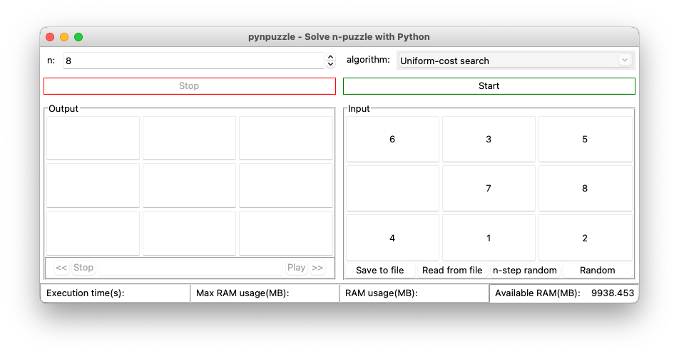

pynpuzzle is an application that helps you to solve n-puzzle problem and also to test your algorithms for n-puzzle problem.
It is written in [Python](https://www.python.org/) and uses [tkinter](https://wiki.python.org/moin/TkInter) for it's graphical interface.



**NOTE**: This project is not actively maintained and you may encounter some issues running it. One known issue is due to the `psutil` library's access denied issue on macOS. Feel free to send a pull request at anytime.

## Installing

### Prerequisites

- [Python3.5+](https://www.python.org/)
- [tkinter](https://wiki.python.org/moin/TkInter)
- [psutil](https://github.com/giampaolo/psutil)

### Debian Linux (Ubuntu)

Open terminal and install these packages:

```Bash
sudo apt-get install python3.5 python3-tk python3-psutil
```

Now you can run pynpuzzle from terminal: `./pynpuzzle`

### Windows

Download and install Python's installer (version 3.5 or higher) from [it's official website](https://www.python.org/downloads/). After
installing python, open command line and install psutil package using pip: `pip install psutil`. Now you can run
pynpuzzle.py from command line: `python pynpuzzle.py`.

## Adding new algorithm

pynpuzzle loads algorithms from _algorithms_ folder next to _pynpuzzle.py_.  
All python files (_.py_) inside this folder (_./algorithms/\*.py_) are considered as algorithms and pynpuzzle tries to load them.  
An algorithm module should have a search function that accepts two arguments.  
First argument is the n-puzzle's current state and the second one is the goal state.  
Each of the arguments are two dimensional lists that represnt a n-puzzle.
For example (test_algorithm.py):

```Python
def search(state, goal_state):
  """
  Test algorithm
  """
  pass

```

Docstring of the function will be presented as the name of the algorithm in app's algorithms combobox (if function has no docstring, module's filename will be used. test_algorithm in this case.).  
And finally, function should return an m\*n\*n three dimensional list which represents a set of paths from state to goal_state.

Logs about algorithm's modules can be seen from menubar's _Show logs_ item.

These algorithms are included in the app and can be used as code examples for adding new and more complex algorithms:

- [A\* tree search algorithm using manhattan distance heuristic](./algorithms/a_star_tree_manhattan_distance.py)
- [A\* tree search algorithm using misplaced tiles heuristic](./algorithms/a_star_tree_misplaced_tiles.py)
- [Breadth-first search algorithm](./algorithms/breadth_first_search.py)
- [Iterative deepening depth-first search algorithm](./algorithms/ids.py)
- [Uniform-cost search algorithm](./algorithms/uniform_cost_search.py)

## Author

Hamidreza Mahdavipanah

## License

[MIT](./LICENSE)
